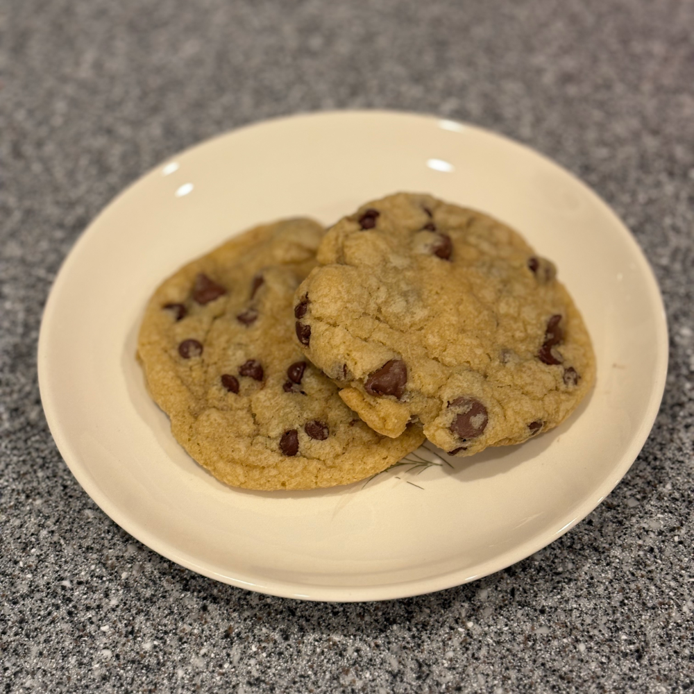

# Molly's Cookies

Yields about 26 cookies.

## Ingredients

| Amount | Ingredient |
| ------ | ---------- |
| 8 ounces | unsalted butter |
| 14 ounces | light brown sugar |
| 1 tablespoon | vanilla extract |
| 2 | eggs |
| 13 ounces | all purpose flour |
| 1 teaspoon | baking soda |
| 1 1/2 teaspoon | salt |
| 8 ounces | milk chocolate |
| 8 ounces | semi sweet chocolate |

## Instructions

### Prep

- Preheat oven to 340°F.
- Line a cookie sheet with parchment paper.

### Recipe

1. In a large bowl, cream butter and sugar.
1. Add eggs and vanilla, beat until incorporated.
1. In a separate bowl, whisk together the flour, baking soda, and salt.
1. Add the dry ingredients and beat on low until incorporated.
1. Add the chocolate chips and fold in with a spatula.
1. Shape the dough into balls.
1. Store in fridge for a least 2 hours.
1. Place dough balls on cookie sheet. Smoosh each ball slightly.
1. Bake for 13 minutes.
1. Remove from oven.
1. Rest for 5 minutes.
1. Transfer to cooling rack.
1. Enjoy.

### Notes

- If baking from frozen, bake 16 min at 350°F.
