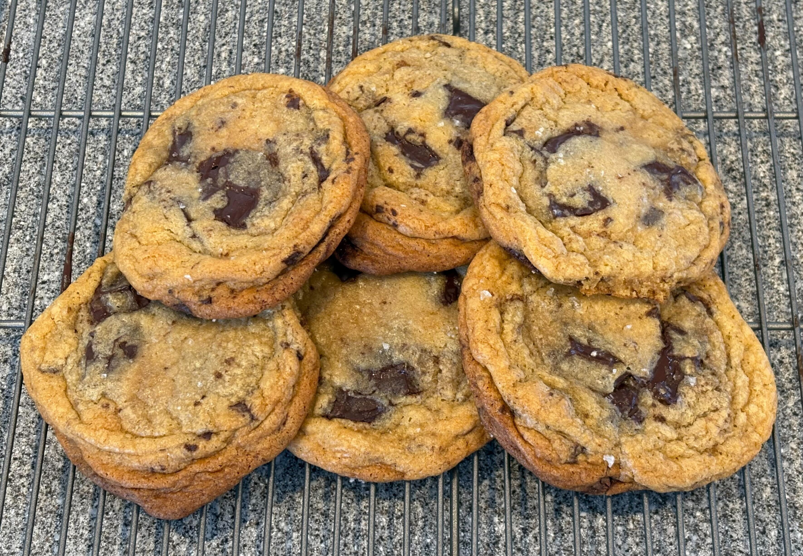

# Chocolate Chunk Cookies

Yields about 18 cookies.

## Ingredients

| Amount | Ingredient |
| ------ | ---------- |
| 2 1/2 sticks (280 grams) | unsalted butter |
| 240 grams | light brown sugar |
| 225 grams | granulated sugar |
| 2 | eggs |
| 2 tsp | vanilla extract |
| 1 1/4 tsp | baking soda |
| 1 1/2 tsp | baking powder |
| 1 1/2 tsp | kosher salt |
| 445 grams | all purpose flour |
| 450 grams | bittersweet chocolate (bar or feves) |
| - | flaky sea salt |

## Instructions

### Prep

- Cut chocolate into largish chunks (~ 5 grams). Don't worry if it breaks into smaller pieces. If using feves, leave them as is.

### Recipe

1. In a large bowl, cream butter and sugars for ~4 min.
1. Add eggs one at a time, beat until incorporated.
1. Add vanilla, beat until incorporated.
1. Scrape down sides.
1. Add baking soda, baking powder, and salt, beat until incorporated.
1. Add flour, beat on low speed until just incorporated.
1. Add chocolate, mix in with spatula.
1. Cover bowl with plastic and chill in fridge for 24 to 72 hours.
1. Preheat oven to 350°F.
1. Line a cookie sheet with parchment paper (or use a silpat).
1. Shape dough into 100 gram balls (these will seem very large).
1. Place 6 balls on cookie sheet. Try to bury chocolate chunks on the bottom of the ball. This will prevent excessive chocolate from sticking to cookie sheet.
1. Bake for 12 minutes.
1. Remove from oven and sprinkle lightly with sea salt.
1. Rotate cookie sheet 180° and bake for 4 minutes.
1. Remove from oven.
1. Rest for 10 minutes.
1. Transfer to cooling rack.
1. Rest for 10 minutes.
1. Enjoy.
